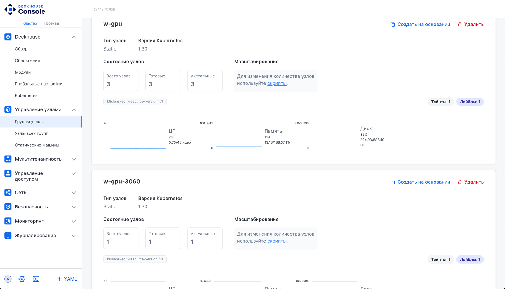

# Часть 2: Настройка Kubernetes, добавление GPU-узлов, установка gpu operator и kuberay operator

В этом разделе мы устанавливаем Kubernetes-кластер с помощью Deckhouse и настраиваем узлы с поддержкой GPU.
Более того, здесь даны подробные комментарии к YAML-файлам конфигурации (config.yml и resources.yml).

## Общий обзор установки
1. Вы логинитесь в приватный Docker Registry Deckhouse, используя предоставленный лицензионный ключ.
2. Запускаете контейнер Deckhouse Installer, где выполняется команда dhctl bootstrap.
3. По завершении развёртывания у вас будет готовый Kubernetes-кластер, который можно масштабировать и дополнять.
4. После успешного запуска кластера устанавливаем и настраиваем KubeRay поверх Kubernetes, что позволит управлять ресурсами GPU в рамках Ray.

---

## Пример запуска

### Шаг 1: Аутентификация и запуск контейнера

```bash
base64 -d <<< <LicenseKey> | docker login -u license-token --password-stdin registry.deckhouse.ru
docker run --pull=always -it \
  -v "$PWD/config.yml:/config.yml" \
  -v "$HOME/.ssh/:/tmp/.ssh/" \
  -v "$PWD/resources.yml:/resources.yml" \
  -v "$PWD/dhctl-tmp:/tmp/dhctl" \
  --network=host \
  registry.deckhouse.ru/deckhouse/ee/install:stable bash
```

### Шаг 2: Внутри контейнера запускаем установку

```bash
dhctl bootstrap --ssh-user=root --ssh-host=192.168.3.51 --ssh-agent-private-keys=/tmp/.ssh/id_ed25519 \
  --config=/config.yml \
  --config=/resources.yml \
  --ask-become-pass
```

---

## Файлы конфигурации

### 1) [config.yml](deckhouse_config/config.yml)
- **ClusterConfiguration** и **InitConfiguration** задают параметры кластера (podSubnetCIDR, serviceSubnetCIDR, kubernetesVersion и т.д.).
- **ModuleConfig** для Deckhouse определяет bundle, releaseChannel, logLevel.
- **global**: publicDomainTemplate, ingressClass и т.д.
- **user-authn**: настройки аутентификации, публикация API (publishAPI).
- Дополнительные модули: csi-ceph, cni-cilium, cert-manager, multitenancy-manager, runtime-audit-engine, operator-trivy, metallb, console, ingress-nginx.
- В конце **StaticClusterConfiguration** — подсети, используемые узлами (internalNetworkCIDRs).

### 2) [resources.yml](deckhouse_config/resources.yml)
1. **CephClusterConnection / CephClusterAuthentication / CephStorageClass**:
   - Адреса мониторов Ceph (monitors) и ключи (userKey).
   - Создание StorageClass для RBD и CephFS.
2. **LocalPathProvisioner**:
   - Локальное хранилище (/data/zdata-relational и т.д.) для узлов w-db.
3. **NodeGroup** (ключевой ресурс Deckhouse):
   - w-gpu, w-gpu-3060: узлы с GPU, лейблы и таинты для ML/AI.
   - w-std: стандартные worker-нод (6 шт.).
   - w-db: узлы для БД (3 шт.).
4. **NodeGroupConfiguration** (скрипты .sh):
   - containerd-additional-config.sh (nvidia-container-runtime),
   - install-cuda.sh (CUDA, nvidia-container-toolkit),
   - add-gitlab-registry-cert (кастомный сертификат для внутреннего реестра).
5. **StaticInstance**:
   - Перечень статических узлов по IP-адресам для SSH-доступа.
6. **IngressNginxController**:
   - Ingress-контроллеры (внешний, внутренний), балансировка через MetalLB.
7. **ClusterAuthorizationRule и User**:
   - Создают пользователи (admin), пароли и права (RBAC).
8. **Secret/TLS**:
   - CA и ClusterIssuer для внутреннего TLS.

-----------------------------------------------------------------------------

## Структура кластера после установки
- 3 Master-ноды
- 6 Worker-нод (w-std)
- 3 Worker-нод для баз данных (w-db)
- 4 GPU-нод (w-gpu, w-gpu-3060)



-----------------------------------------------------------------------------

## Установка и настройка kuberay поверх k8s

После успешного развёртывания Deckhouse-кластера можно добавить KubeRay:
1. При желании установить **Argo CD**, чтобы управлять манифестами и хелм-чартами через GitOps.
2. Или использовать Helm напрямую для установки нужных компонентов.

### Установка GPU Operator
- [Ссылка на GPU Operator](https://github.com/NVIDIA/gpu-operator).
#### Назначение
NVIDIA GPU Operator упрощает и автоматизирует процесс установки и обновления драйверов, утилит и сервисов для GPU на узлах Kubernetes. Он проверяет, какие ноды имеют GPU, и разворачивает на них:

- **NVIDIA драйвер** (может собирать динамически или использовать готовые образы при наличии поддержки в вашей ОС).
- **nvidia-container-runtime** для того, чтобы Pod’ы, запущенные на GPU-нодах, могли видеть устройства GPU и использовать их.
- **DCGM (Data Center GPU Manager)** и **DCGM Exporter** для метрик и мониторинга.
- **MIG Manager** (при необходимости), если вы используете разбивку GPU (Multi-Instance GPU).

#### Как это работает
1. Operator реагирует на появление (или изменение) узлов с лейблами вида `nvidia.com/gpu.deploy.operands=true` (или аналогичной логики) и устанавливает на них драйверы и сервисы.
2. Каждая нода получает DaemonSet от GPU Operator, который разворачивает нужные компоненты.
3. Управление драйверами: обновления, перезагрузка при новых версиях, мониторинг статуса (через DCGM).

#### Файл [ap-values.yaml](argo-projects/gpu-operator/charts/gpu-operator/ap-values.yaml)
В файле `ap-values.yaml` для GPU Operator задаются:
- Путь к **репозиторию NVIDIA** (registry, теги образов).
- Включение/выключение **Node Feature Discovery** (NFD), который автоматически определяет тип GPU и добавляет лейблы.
- Детальная настройка **daemonsets**, **updateStrategy**, **tolerations**, при желании – **driver** (версия, precompiled драйверы, запуск autoUpgrade).
- Включение отдельных компонентов (MIG, DCGM, DCGM Exporter, GDS, vGPU, VFIO и пр.).

Ключевые поля:
- `driver.enabled: true/false` – указывает, нужно ли устанавливать драйвер напрямую.
- `mig.strategy: single` – обозначает, используете ли вы MIG в полном объёме, частично или вовсе нет.
- `devicePlugin.enabled: true` – активирует установку Device Plugin, чтобы Kubernetes мог корректно назначать GPU-поды на узлы.
- `dcgm.enabled: true / dcgmExporter.enabled: true` – управляют сбором метрик GPU.

---

### Установка KubeRay Operator
- [Ссылка на KubeRay Operator](https://github.com/ray-project/kuberay/tree/master/helm-chart/kuberay-operator).

#### Назначение
**KubeRay Operator** – это оператор для Kubernetes, позволяющий:
- Создавать, управлять и масштабировать **Ray-кластеры** (RayCluster CRD).
- Запускать задачи и сервисы в виде RayJob, RayService и т.д.
- Автоматически распределять нагрузку по доступным узлам (включая GPU-ноды).

#### Как это работает
1. KubeRay Operator устанавливает **Custom Resource Definitions** (CRDs), такие как `RayCluster`, `RayJob`, `RayService`.
2. Когда в кластере появляется ресурс типа `RayCluster`, оператор создаёт нужное количество Pod’ов Ray (Head, Worker) и управляет их жизненным циклом (автоматический рестарт, масштабирование, обновления).
3. Для работы с GPU Operator KubeRay Operator использует нативные механизмы Kubernetes (labels, taints, Device Plugin и пр.), чтобы запускать Ray Worker’ы на узлах, где есть доступные GPU.

#### Файл [ap-values.yaml](argo-projects/kube-ray/charts/kuberay-operator/ap-values.yaml)
В конфигурационном файле для KubeRay Operator можно указать:
- **Образ** оператора (репозиторий, теги).
- **Параметры Pod Security** (securityContext, podSecurityContext), если важен комплаенс.
- **RBAC** (роль, которую получит оператор), в том числе для leader election и управления ресурсами в своих пространствах имен.
- **watchNamespace** – список пространств имён, в которых оператор будет слушать события CRD (можно ограничиться одним namespace).
- **batchScheduler** – если хотите интеграцию с кастомными шедулерами (Volcano, YuniKorn).
- **Env-переменные** (например, `ENABLE_INIT_CONTAINER_INJECTION=true`), управляющие поведением Ray-подов.

Пример с подробными комментариями приведён в блоке `values.yaml` в вашем тексте. Ключевые моменты:
- `image.repository` и `image.tag` – где хранится оператор.
- `resources` – рекомендуемые ресурсы для Pod’а оператора (CPU, RAM).
- `leaderElectionEnabled` – нужен, если вы хотите запускать несколько реплик оператора для отказоустойчивости.
- `singleNamespaceInstall` – при значении `true` оператор будет работать только в одном namespace и вы не сможете управлять Ray-кластерами за его пределами.

---

### Итог
1. Настроен Deckhouse для управления кластером (Ceph, Ingress, Cilium, MetalLB и др.).
2. Настроены узлы с GPU (CUDA, nvidia-container-runtime), что даёт возможность запускать высоконагруженные задачи.
3. Установлен **GPU Operator** (от NVIDIA) для автоматического управления драйверами, мониторингом и ресурсами GPU.
4. Установлен **KubeRay Operator**, который позволяет разворачивать Ray-кластеры и использовать ресурсы GPU непосредственно внутри Kubernetes.
